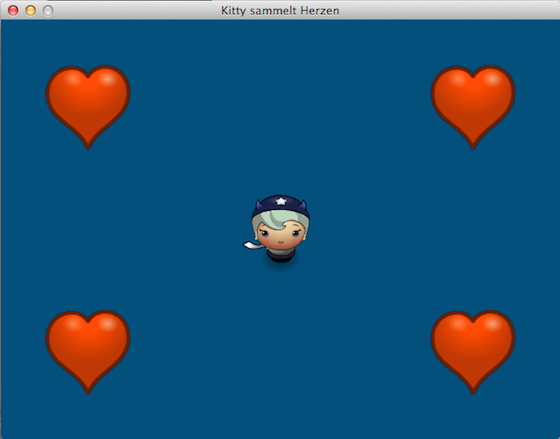

# Ein erstes Spiel

Nun möchte ich *in medias res* gehen und ein erstes »Spiel« mit Cocos2d entwickeln, das in die Möglichkeiten dieses Frameworks einführt. Es ist noch kein echtes Spiel (dafür ist es zu wenig herausfordernd), aber ein paar wichtige Grundlagen wie die Erkennung von Tastatureingaben und von Kollisionen sollen anhand dieses Beispiels erläutert werden.

Die aus dem letzten Abschnitt bekannte Spielfigur »Hörnchen« soll auf einem Spielfeld vier Herzen einsammeln. Die Startposition des Spiels ist aus dem obigen Screenshot ersichtlich. Zu Beginn verwende ich das Programmgerüst aus dem [letzten Abschnitt](hellohoernchen.md), nur daß ich das Fenster auf 640x480 Pixel vergrößert und zwei Funktionen, die den Tastatur-Input verarbeiten, eingefügt habe:

~~~python
import cocos
from cocos.director import director 
from cocos.scene import Scene
from cocos.layer import ColorLayer
from cocos.sprite import Sprite
from pyglet.window import key

class Game(ColorLayer):
    
    is_event_handler = True
    
    def __init__(self):
        super(Game, self).__init__(0, 80, 125, 255)
        self.player = Sprite("assets/horngirl.png")
        self.player.position = 320, 240
        self.add(self.player)
    
    def on_key_press(self, k, m):
        print("Pressed", key.symbol_string(k))
    
    def on_key_release(self, k, m):
        print("Released", key.symbol_string(k))

def main():
    director.init(caption = "Moving Kitty", width = 640, height = 480)
    scene = Scene(Game())
    director.run(scene)

if __name__ == "__main__":
    main()
~~~

Die Angabe der Fenstergröße wäre nicht nötig gewesen, den 640x480 Pixel ist die Default-Größe, aber der Ordnung halber und falls ich doch irgendwann die Größe des Fensters verändern will, habe ich sie angegeben.

## Das Cocos2d-Koordinatensystem

Wenn Ihr mit den Koordinaten des Players (also »Hörnchen«) in der Zeile

~~~python
        self.player.position = 320, 240
~~~

ein wenig herumspielt (setzt sie zum Beispiel mal auf `50, 50` oder `590, 430`), dann erkennt Ihr, daß das Cocos2d-Koordinatensysten seinen Urpsrung in der linken, **unteren** Ecke des Fensters hat und nicht -- wie allgemein üblich -- in der linken, **oberen** Ecke. Das ist erst einmal ungewohnt, aber für Spiele in der Regel doch sinnvoll. Man erspart sich einige Umrechnungen und Transformationen.

Außerdem sind die Sprite-Koordinaten per Default im Mittelpunkt des Sprites und nicht, wie in vielen anderen Bibliotheken, in der linken oberen Ecke.

## Nutzer-Eingaben verarbeiten

Jeder Layer von Cocos2d kennt fünf verschiedene *Event Handler*, die auf die Eingabe des Nutzers reagieren. Diese sind jedoch per default auf `False` gesetzt und müssen daher mit der Zeile

~~~python
    is_event_handler = True
~~~

scharf geschaltet werden. Diese fünf *Event Handler* sind:

-  `on_mouse_motion(x, y, dx, dy)`: Hier sind `x, y` die aktuellen Mauskoordinaten und `dx, dy` die Distanz seit dem letzten Funktionsaufruf.

- `on_mouse_press(x, y, buttons, modifiers)`: Wie oben sind `x, y` die aktuellen Mauskoordinaten, jedoch werden diese nur übergeben, wenn eine Maustaste gedrückt wird.

- `on_mouse_drag(x, y, dx, dy, button, modifiers)`: Diese Funktion ist eine Kombination der beiden obigen Funktionen, die aufgerufen wird, wenn die Maus mit einer oder mehrerer gedrückter Tasten bewegt wird.

- `on_key_press(key, modifiers)`: Diese Funktion wird aufgerufen, wenn eine Taste gedrückt wird.

- `on_key_release(key, modifiers)`: Diese Funktion wird aufgerufen, wenn eine Taste losgelassen wird.

Die Parameter `button` und `modifiers` kommen aus `pyglet.window.mouse` und `pyglet.window.key` und betreffen die Maustasten und die Sondertasten, wie zum Beispiel *Shift*, *Alt* oder die Pfeiltasten. Da ich diese für das Beispielprogramm benötige, habe ich die entsprechende PyGlet-Konstanten mit der Zeile

~~~python
from pyglet.window import key
~~~

importiert. Überhaupt ist PyGlet so eng verzahnt mit Cocos2d, daß immer wieder PyGlet-Konstanten oder -Funktionen in einem Cocos2d-Programm aufgerufen werden müssen.

Wie man in obigem Screenshot sehen kann, funktioniert so die Keyboard-Abfrage auch mit den Sondertasten wie den Pfeiltasten oder der Leertaste. Für Spiele ein nicht unwichtiger Faktor.

## Kitty bewegt sich

Nun soll unsere Spielfigur auf die Tastatursteuerung reagieren und sich in Richtung der Pfeiltasten bewegen. Dazu habe ich das Programm noch einmal erweitert:

~~~python
import cocos
from cocos.director import director 
from cocos.scene import Scene
from cocos.layer import ColorLayer
from cocos.sprite import Sprite

from collections import defaultdict
from pyglet.window import key

class Game(ColorLayer):
    
    is_event_handler = True
    
    def __init__(self):
        super(Game, self).__init__(0, 80, 125, 255)
        self.player = Sprite("assets/horngirl.png")
        self.player.position = 320, 240
        self.add(self.player)
        
        self.speed = 100.0
        self.pressed = defaultdict(int)
        self.schedule(self.update)
    
    def on_key_press(self, k, m):
        self.pressed[k] = 1
    
    def on_key_release(self, k, m):
        self.pressed[k] = 0
    
    def update(self, dt):
        x = self.pressed[key.RIGHT] - self.pressed[key.LEFT]
        y = self.pressed[key.UP] - self.pressed[key.DOWN]
        if (x != 0) or (y != 0):
            pos = self.player.position
            new_x = pos[0] + self.speed * x * dt
            new_y = pos[1] + self.speed * y * dt
            self.player.position = (new_x, new_y)

def main():
    director.init(caption = "Moving Kitty", width = 640, height = 480)
    scene = Scene(Game())
    director.run(scene)

if __name__ == "__main__":
    main()
~~~

Zuerst habe ich aus `collections` zusätzlich das `defaultdict` importiert, eine Datenstruktur, genauer ein *Dictionary*, in das die Werte den entsprechenden Tastaturnamen zugeordnet werden können. Das geschieht in den Funktionen `on_key_press()` und `on_key_release()`.

Die `update()`-Funktion macht es sich durch einen Trick besonders einfach: Da eine Taste, die nicht gedrückt ist, immer den Wert `0` besitzt, sind die Werte von `x` und `y` immer `1`, `0` oder `-1`. Das wird durch die Zeilen

~~~python
        x = self.pressed[key.RIGHT] - self.pressed[key.LEFT]
        y = self.pressed[key.UP] - self.pressed[key.DOWN]
~~~

erreicht. Und nur wenn ener der Werte ungleich `0` ist, wird eine neue Position berechnet und das Hörnchen durch das Fenster bewegt.

**Caveat**: Es gibt keine Abfrage der Fenstergrenzen, Ihr könnt also die Spielfigur auch außerhalb des Fensters schieben.

## Kollisions-Erkennung

Die Kollisions-Erkennung von Cocos2d wird im Paket `cocos.collision_model` durch die Klassen des `CollsionManager` erledigt. Also gilt es zuerst, das Paket zu importieren:

~~~python
import cocos.collision_model as cm
~~~

Der `CollisionManager` ist in zwei Klassen aufgeteilt:

- Der `CollisionManagerBruteForce` beachtet alle Entities und berechnet eine mögliche Kollision. Die Klasse ist nur für *Debugging*-Zwecke gedacht, da sie schlecht skaliert, wenn die Zahl der möglichen Kollisionen wächst.

- Das `CollisionManagerGrid` teilt das Fenster in rechteckige Zellen auf und berücksichtigt nur die Entities für eine mögliche Kollision, die mit dem Spieler die gleiche Zelle teilen. Das skaliert natürlich viel besser. Die empfohlene Zellgröße ist die Breite und Höhe des größten *Actors*, multipliziert mit 1,25.

Jedes Objekt wird für eine mögliche Kollision in Betracht gezogen, wenn es eine Instanz von `Cshape` besitzt, die ebenfalls aus dem Paket `cocos.collsion_model` importiert wird. Es gibt zwei Klassen in Cocos2d, die von *Cshape* erben:

- `CircleShape`: Hier wird ein Kreis um die Spielfigur gezogen und wenn sich zwei Kreise überlappen, das heißt, wenn der Abstand beider Kreise kleiner ist als die Summe beider Radii, wird eine Kollision festgestellt. Abstandsfunktion ist der einfache [euklidische Abstand](https://de.wikipedia.org/wiki/Euklidischer_Abstand).

- `AARectShape`: Hier wird ein Rechteck um die Spielfigur gezogen und wenn sich beide Rechtecke überlappen, wird eine Kollision festgestellt. Diese Kollisionserkennung funktionert sehr gut, wenn die Spielfiguren eng ein Quadrat ausfüllen oder wenn sie nicht rotieren. Als Abstandsfunktion wird hierbei die [Manhattan-Distanz](https://de.wikipedia.org/wiki/Manhattan-Metrik) genutzt.

Für das Beispielprogramm habe ich den `CircleShape` gewählt und da dieser `cocos.euclid.Vector2` nutzt, habe ich diesen in der Zeile

~~~python
import cocos.euclid as eu
~~~

ebenfalls importiert. Mit den beiden Zeilen

~~~python
        self.position = pos = eu.Vector2(x, y)
        self.cshape = cm.CircleShape(pos, self.width/2 - 10)
~~~

habe ich den `CircleShape` implementiert. Damit es keine Fernkollisionen gibt, habe ich den Radius der Spielfigur um 10 Pixel verkleinert um sicherzugehen, daß *Hörnchen* auch tatsächlich die Herzen berührt, die sie aufsammelt. In der `__init__()`-Methode der Klasse `Game` habe ich mit den Zeilen

~~~python
        cell = self.player.width * 1.25
        self.collman = cm.CollisionManagerGrid(0, 640, 0, 480, cell, cell)
~~~

die Zellengröße festgelegt und den Kollisions-Manager initialisiert. Und die `update()`-Methode erhielt die folgenden Zeilen,

~~~python
        self.collman.clear()
        for _, node in self.children:
            self.collman.add(node)
        for other in self.collman.iter_colliding(self.player):
            self.remove(other)
~~~

mit der die möglichen Kollisionen überprüft werden und die nach einer Kollision die entsprechenden Herzchen verschwinden.

## Der vollständige Quellcode

Hier nun der vollständige Quellcode des fertigen Programms:

~~~python
import cocos
from cocos.director import director 
from cocos.scene import Scene
from cocos.layer import ColorLayer
from cocos.sprite import Sprite

import cocos.collision_model as cm
import cocos.euclid as eu

from collections import defaultdict
from pyglet.window import key

class Actor(Sprite):
    
    def __init__(self, x, y, pic):
        super(Actor, self).__init__(pic)
        self.position = pos = eu.Vector2(x, y)
        self.cshape = cm.CircleShape(pos, self.width/2 - 10)

class Game(ColorLayer):
    
    is_event_handler = True
    
    def __init__(self):
        super(Game, self).__init__(0, 80, 125, 255)
        
        self.heart_pic = "assets/heart.png"
        for pos in [(100, 100), (540, 380), (540, 100), (100, 380)]:
            self.add(Actor(pos[0], pos[1], self.heart_pic))
        self.player = Actor(320, 240, "assets/horngirl.png")
        self.add(self.player)
        
        cell = self.player.width * 1.25
        self.collman = cm.CollisionManagerGrid(0, 640, 0, 480, cell, cell)
        
        self.speed = 100.0
        self.pressed = defaultdict(int)
        self.schedule(self.update)
    
    def on_key_press(self, k, m):
        self.pressed[k] = 1
    
    def on_key_release(self, k, m):
        self.pressed[k] = 0
    
    def update(self, dt):
        # print(dt)
        self.collman.clear()
        for _, node in self.children:
            self.collman.add(node)
        for other in self.collman.iter_colliding(self.player):
            self.remove(other)
        
        x = self.pressed[key.RIGHT] - self.pressed[key.LEFT]
        y = self.pressed[key.UP] - self.pressed[key.DOWN]
        if (x != 0) or (y != 0):
            pos = self.player.position
            new_x = pos[0] + self.speed * x * dt
            new_y = pos[1] + self.speed * y * dt
            self.player.position = (new_x, new_y)
            self.player.cshape.center = self.player.position

def main():
    director.init(caption = "Kitty sammelt Herzen", width = 640, height = 480)
    scene = Scene(Game())
    director.run(scene)

if __name__ == "__main__":
    main()
~~~

Cocos2d zeichnet die einzelnen Sprites in der Reihenfolge ihres Auftretens. Daher habe ich zuerst die Herzchen und dann das Hörnchen zeichnen lassen. Damit ihr das »Spiel« nachprogrammieren könnt, hier auch noch die dafür benötigten Bilder:

 
