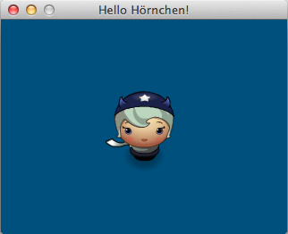

# Hallo Hörnchen

## Quellcode

~~~python
import cocos
from cocos.director import director 
from cocos.scene import Scene
from cocos.layer import ColorLayer
from cocos.sprite import Sprite

class Game(ColorLayer):
    
    def __init__(self):
        super(Game, self).__init__(0, 80, 125, 255)
        self.player = Sprite("assets/horngirl.png")
        self.player.position = 160, 120
        self.add(self.player)

def main():
    director.init(caption = "Hello Hörnchen!", width = 320, height = 240)
    scene = Scene(Game())
    director.run(scene)

if __name__ == "__main__":
    main()
~~~
