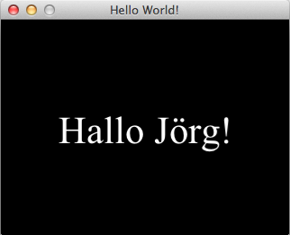

# Hello Cocos2d

<iframe style="width:120px;height:240px;" marginwidth="0" marginheight="0" scrolling="no" frameborder="0" src="//ws-eu.amazon-adsystem.com/widgets/q?ServiceVersion=20070822&amp;OneJS=1&amp;Operation=GetAdHtml&amp;MarketPlace=DE&amp;source=ss&amp;ref=as_ss_li_til&amp;ad_type=product_link&amp;tracking_id=derschockwell-21&amp;marketplace=amazon&amp;region=DE&amp;placement=1785281534&amp;asins=1785281534&amp;linkId=5e70cde5b4d103f0248556041304f48b&amp;show_border=true&amp;link_opens_in_new_window=true"></iframe>

[Cocos2d](http://cocos2d.org/) ist ein freies (BSD-Lizenz) Framework für die Spieleentwicklung, das es für diverse Plattformen und Sprachen gibt, zum Beispiel für [Objektive-C/Swift](http://cocos2d-objc.org/) und [JavaScript](http://www.cocos2d-x.org/wiki/Cocos2d-JS), aber eben auch für [Python](http://python.cocos2d.org/), wobei die Python-Implementierung sogar die erste Implementierung dieses Frameworks war. Ich hatte das Framework [vor Jahren schon einmal im Fokus](http://blog.schockwellenreiter.de/essays/cocos2danaconda.html), aber dann aus den Augen verloren. Nun war mir aber [jüngst](Python Game Programming By Example – 20170322) das Buch »[Python Game Programming by Example][amazon]« untergekommen und darin sind drei (von sieben) Kapitel diesem Framework gewidmet. Und so bekam ich Lust, damit ein wenig herumzuspielen. Die Installation war einfach, mit

~~~bash
pip install cocos2d
~~~

wurde nicht nur dieses Framework, sondern gleich auch [PyGlet](cp^PyGlet) mit installiert, denn [Cocos2d (Python)](cp^cocos2d) setzt auf PyGlet auf.

## Quellcode 

Mein Ziel war, erst einmal ein sauberes »Hallo Welt«-Beispiel auf meinen Monitor zu bringen, das dann Schritt für Schritt ausgebaut werden kann und mit dem ich dann die einzelnen Module dieses Frameworks kennenlerne. Hier ist dieses *Bare bones Cocos2d Skeleton*:

~~~python
import cocos
from cocos.director import director 
from cocos.scene import Scene
from cocos.text import Label
from cocos.layer import Layer

class HelloWorld(Layer):                              
     def __init__(self):                               
         super(HelloWorld, self).__init__()            
         hello_world_label = Label(                    
             "Hallo Jörg!",                           
             font_name = "Times New Roman",            
             font_size = 32,                           
             anchor_x = 'center',                      
             anchor_y = 'center'                       
         )                                             
         hello_world_label.position = 160, 120         
         self.add(hello_world_label)    

def main():
    director.init(caption = "Hello World!", width = 320, height = 240)
    scene = Scene(HelloWorld())
    director.run(scene)

if __name__ == "__main__":
    main()
~~~

Man sieht hier schon, wie die einzelnen Klassen in Cocos2d voneinander abhängig sind: Eine `Scene` enthält mindestens einen `Layer`, der dann die Objekte (in diesem einfachen Fall nur ein `Label`) enthält. Und der `director` -- wie könnte es anders sein -- überwacht und kontrolliert das Ganze. Deswegen kann es hier auch nur einen geben.

<iframe style="width:120px;height:240px;" marginwidth="0" marginheight="0" scrolling="no" frameborder="0" src="//ws-eu.amazon-adsystem.com/widgets/q?ServiceVersion=20070822&amp;OneJS=1&amp;Operation=GetAdHtml&amp;MarketPlace=DE&amp;source=ss&amp;ref=as_ss_li_til&amp;ad_type=product_link&amp;tracking_id=derschockwell-21&amp;marketplace=amazon&amp;region=DE&amp;placement=1784390070&amp;asins=1784390070&amp;linkId=11c0e57c93f0db0c033bbf15ea397bdc&amp;show_border=true&amp;link_opens_in_new_window=true"></iframe>

Diese Struktur ist in allen Cocos2d-Dialekten gegeben, das heißt, wenn man mit der Python-Version vertraut ist, fällt einem der Umstieg auf die JavaScript-Version auch nicht mehr so schwer. Das ist ein wenig so wie in Processing (Java, Python, JavaScript) und es gibt auch ein [schönes Buch][amazon2] zur JavaScript-Version von Cocos2d, das ich Interessierten guten Gewissens empfehlen kann. Aber ich will mich zuerst einmal mit der Python-Version von Cocos2d weiter vertraut machen bevor ich mich an weitere Experimente wage.

[amazon]: https://www.amazon.de/Python-Programming-Example-Alejandro-Rodas/dp/1785281534/ref=as_li_ss_tl?ie=UTF8&qid=1490954050&sr=8-1&keywords=Python+Game+Programming+by+Example&linkCode=ll1&tag=derschockwell-21&linkId=f2debaceb82b32d7515b222ebccda3f6
