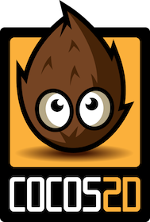

# Learning Cocos2d (Python)

Cocos2d ist ein freies (BSD-Lizenz) Framework für die Spieleentwicklung, das es für diverse Plattformen und Sprachen gibt, zum Beispiel für Objektive-C/Swift und JavaScript, aber eben auch für Python, wobei die Python-Implementierung sogar die erste Implementierung dieses Frameworks war.

## Tutorials

- A very basic Cocos2d tutorial, [part 1](http://www.natan.termitnjak.net/tutorials/cocos2d_basic_1.html), [part 2](http://www.natan.termitnjak.net/tutorials/cocos2d_basic_2.html) and [part 3](http://www.natan.termitnjak.net/tutorials/cocos2d_basic_3.html)
- Cocos2D Python Ultimate Guide - [Part 1](http://blog.liamrahav.me/2015/06/05/cocos2d-python-1/) und [Part 2](http://blog.liamrahav.me/2015/06/11/cocos2d-python-2/)
- [Cocos Python Tutorials](https://github.com/LiamRahav/cocos2d-python-tutorials) (das GitHub Repositorium zu obigen Tutorials)

## Links

- [Cocos2d (Python) Home](http://python.cocos2d.org/)
- [Cocos2d (Python) @ GitHub](https://github.com/los-cocos/cocos)
- Die »offiziellen«[Dokumentationsseiten](http://python.cocos2d.org/doc.html) zu Cocos2d (Python)
- Cocos2d (Python) [Quickstart](http://python.cocos2d.org/doc/programming_guide/quickstart.html)
- Cocos2d (Python) [Programming Guide](http://python.cocos2d.org/doc/programming_guide/)

